# <center> Final Lab</center>

---

## **I. Phân tích bài toán**
### 1.1 Local
  - Như các bài lab trước chúng ta đã có thể làm được đó là Gitlab -> Jenkins -> Harbor -> ArgoCD ở kéo images và chart từ harbor về
  - Ở bài này chúng ta cần là triển khai 1 url ra bên ngoài là `dr.thongdev.site` để user click vào là sử dụng ứng dụng
  - Flow là user truy cập `dr.thongdev.site` -> CloudFlare Global (zero trust) -> truyền xuống CloudFlare Agent -> gọi đến Nginx Ingress Local -> tự động gọi đến FE và BE ở trong khối k8s
  
### 1.2 Cloud
  - Đầu tiên ta cần có cụm EKS, ArgoCD, Cert Manager, AWS ALB Ingress Controller. Tất cả những phần này ở các bài lab trước đã dựng rồi ta sẽ không nói lại nữa và coi như đã có
  - Giờ ta cần tạo AWS ECR, cần 1 gitlab chứa 1 repo để lưu lại các file manifest cho cụm EKS
  - Flow sẽ là Jenkins -> đẩy docker images lên ECR, manifest lên gitlab -> ArgoCD cloud kéo manifest về để apply lên cụm EKS

---

## **II. Tiến hành triển khai**
### 2.1 Local
#### 2.1.1: Cài đặt CloudFlare Agent, Nginx Ingress
  - Cài đặt CloudFlare Agent
    ```bash
      helm repo add cloudflare https://cloudflare.github.io/helm-charts
      helm repo update
      helm install cloudflare-agent cloudflare/cloudflare-utils \
        --namespace cloudflare-agent --create-namespace \
        --set cloudflared.token=<YOUR_TUNNEL_TOKEN>
    ```
    - `YOUR_TUNNEL_TOKEN` chính là khi ta ấn vào lựa chọn Docker ở ảnh dưới nó sẽ có token trong đó
      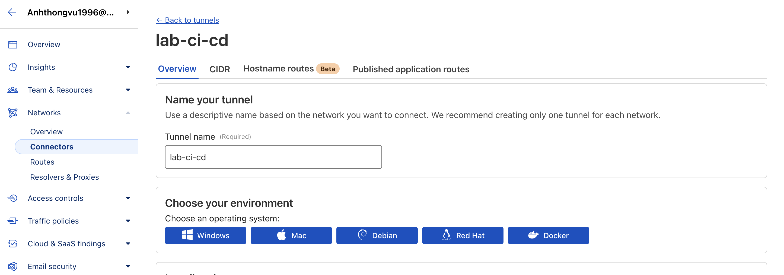
    - Để kiểm tra có CloudFlare Agent ta dùng lệnh
      ```bash
        kubectl get pods -A | grep cloud
      ```
    - Kết mà có như ảnh là được
    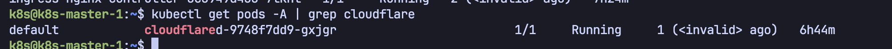
  - Cài đặt Nginx Ingress vào cụm k8s
    ```bash
      helm install ingress-nginx ingress-nginx/ingress-nginx \
        --namespace ingress-nginx --create-namespace \
        --set controller.service.type=ClusterIP \
        --set controller.watchIngressWithoutClass=true
    ```
  - Chúng ta sử dụng type ClusterIP vì chúng ta không có nhu cầu phải mở cổng port, giúp bảo mật hơn
    - Nhưng tại sao việc không mở port lại bảo mật hơn ?
    - Là vì khi đó chỉ có mỗi 1 mình CloudFlare Agent chúng ta cài trong cụm k8s sẽ mới có thể biết được Nginx Ingress, các thành phần khác trong mạng nội bộ không cần nhìn thấy nó
    - Ở cấu hình trên CloudFlare ta cũng chỉ cần nhỉ hình, trong URL ta điền `ingress-nginx-controller.ingress-nginx.svc.cluster.local:80`
    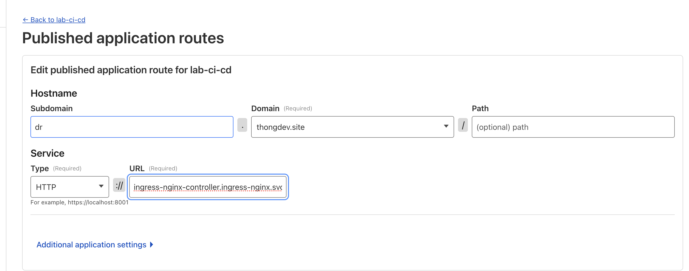
    - Làm sao để biết dòng URL điển gì ta dùng lệnh
    ```bash
       kubectl get svc -n ingress-nginx
    ```
    - Nhìn vào bảng kết quả (giống trong ảnh của bạn):
      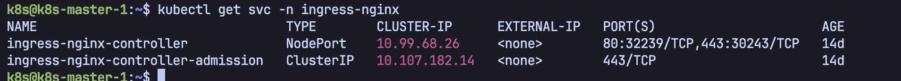
      - Cột NAME: Bạn thấy ingress-nginx-controller. -> Lấy được phần đầu.
      - Cột PORT(S): Bạn thấy 80:32239/TCP. Số 80 ở phía trước dấu hai chấm chính là cổng nội bộ. -> Lấy được phần đuôi :80. (ở đây nếu dòng đầu tiên type là ClusterIP cũng không sao)
      - Namespace: Chính là cái tên -n ingress-nginx bạn gõ trong lệnh -> Lấy được phần giữa.
  - Ta có 1 file `ingress-local.yaml` giúp cho Nginx Ingress Local điều hướng đến front scv hay be scv
    ```bash
        apiVersion: networking.k8s.io/v1
        kind: Ingress
        metadata:
          name: dr-app-ingress
          annotations:
            kubernetes.io/ingress.class: "nginx"
            # Tự động chuyển hướng về trang chủ nếu cần
            nginx.ingress.kubernetes.io/rewrite-target: /
        spec:
          rules:
          - host: {{ .Values.ingress.host | quote }} # Lấy dr.thongdev.site từ values.yaml
            http:
              paths:
              - path: /
                pathType: Prefix
                backend:
                  service:
                    name: {{ .Values.frontend.name }}-svc
                    port:
                      number: 80
              - path: /api
                pathType: Prefix
                backend:
                  service:
                    name: {{ .Values.backend.name }}-svc
                    port:
                      number: 80
    ```
#### 2.1.2: Deploy bằng ArgoCD
- Giờ ta tiền hành dùng ArgoCD cấu hình lấy docker iamges và helm chart từ harbor
- Ta tiến hành tạo kết nối repo để được như ảnh
  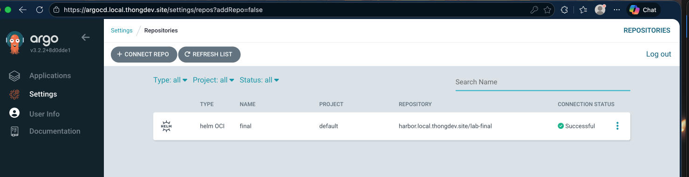
- Tiếp đến là ấn vào create application 
  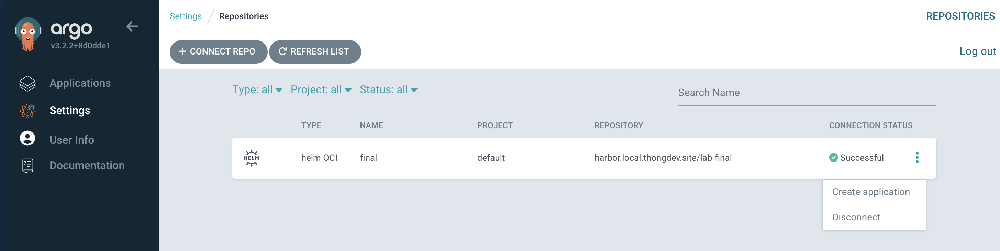 
- Cách kết nối repo và tạo application thì các bài lab trước đã có hướng dẫn rồi
  (tham khảo [tại đây](https://github.com/ThongVu1996/cd-ci-lab/blob/master/argocd/argocd-with-helm.md), search `Bước 4: Triển khai với helm lưu trữ trên Harbor bằng ArgoCD` cho nhanh thấy)
- Sau đó ta được kết quả như hình
  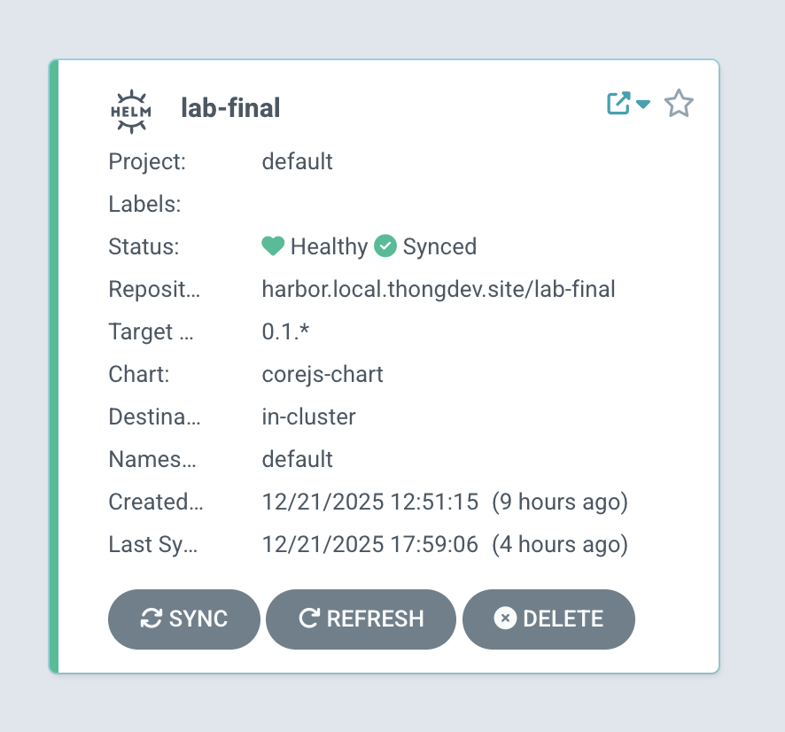
  
  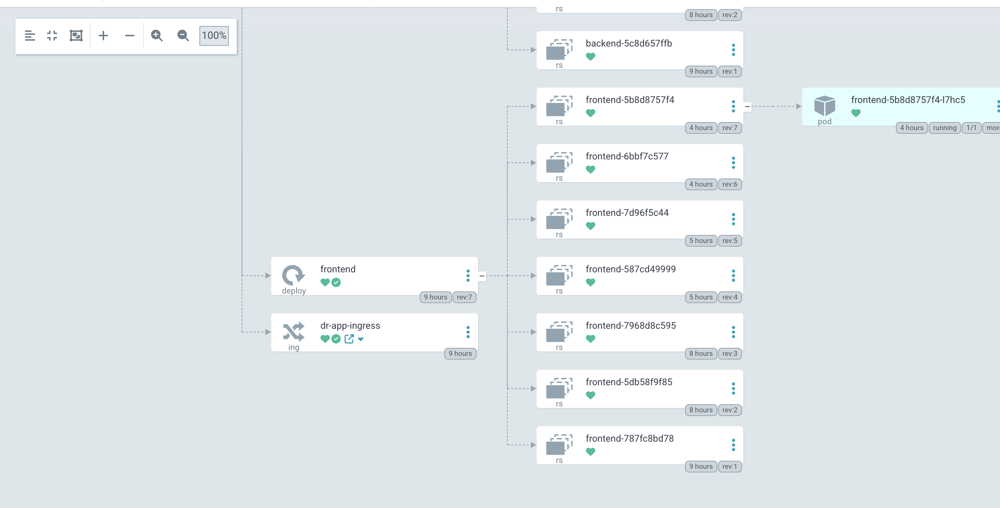
- Truy cập vào `dr.thongdev.site` ta được như hình
  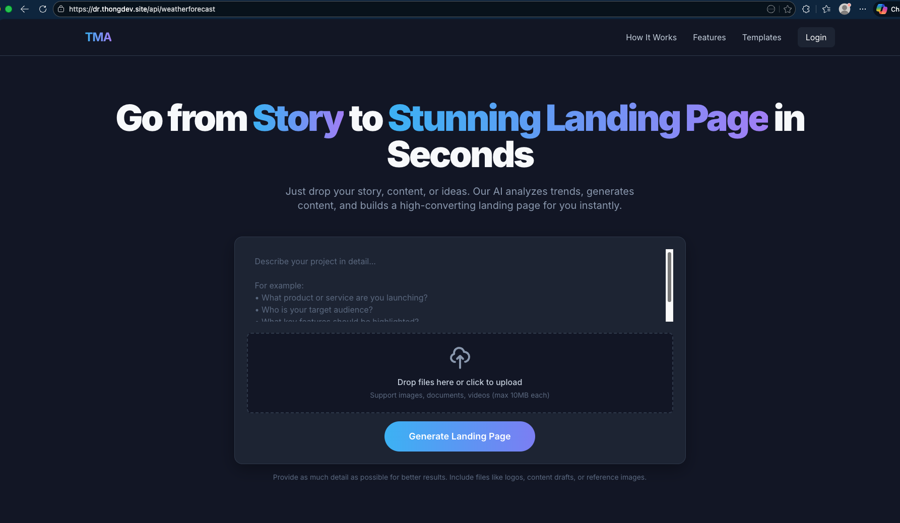
  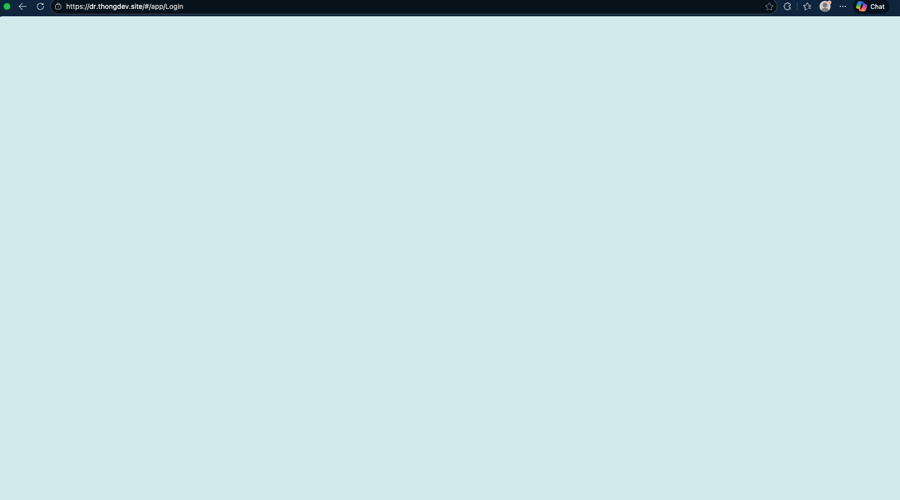
- Như vậy là ta đã hoàn thành ở xong kết quả ở dưới local

### 2.2 Cloud
#### 2.2.1 Cài đặt AWS ECR
- Vào AWS Console -> search ERC -> Chọn cái đều tiên như hình
  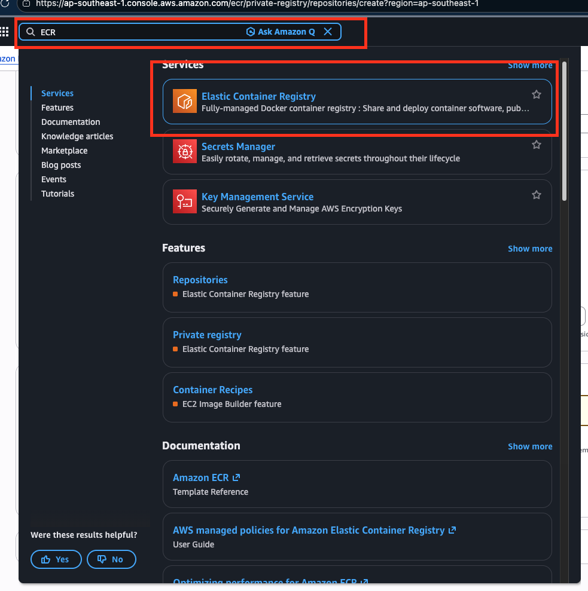
- Nhấn create
  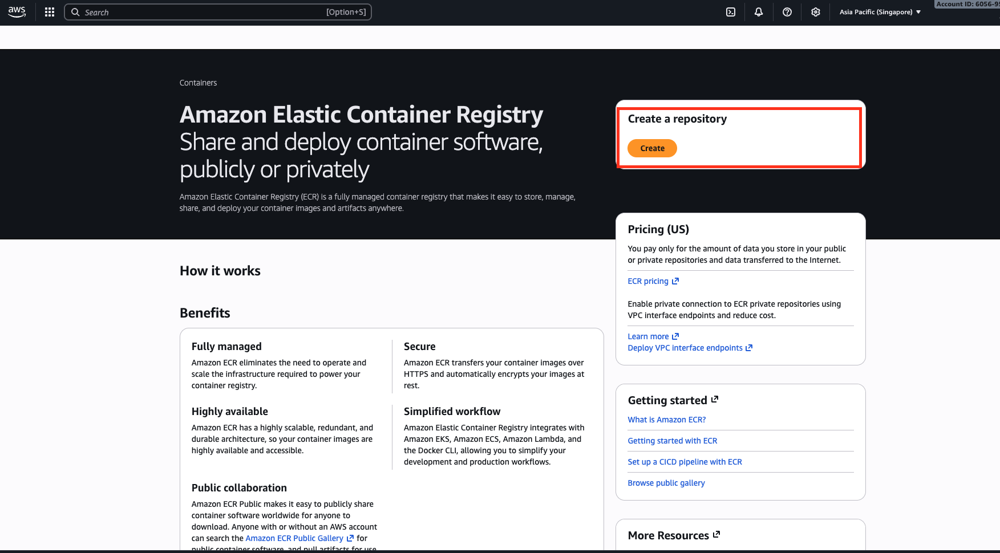
- Nhấn create repository
  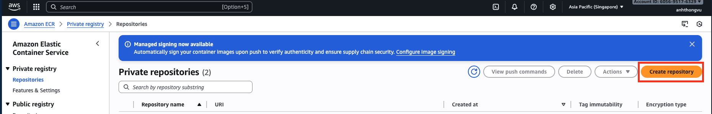
- Điền tên repository lab-final/frontend, các lựa chọn khác để default -> nhấn create
  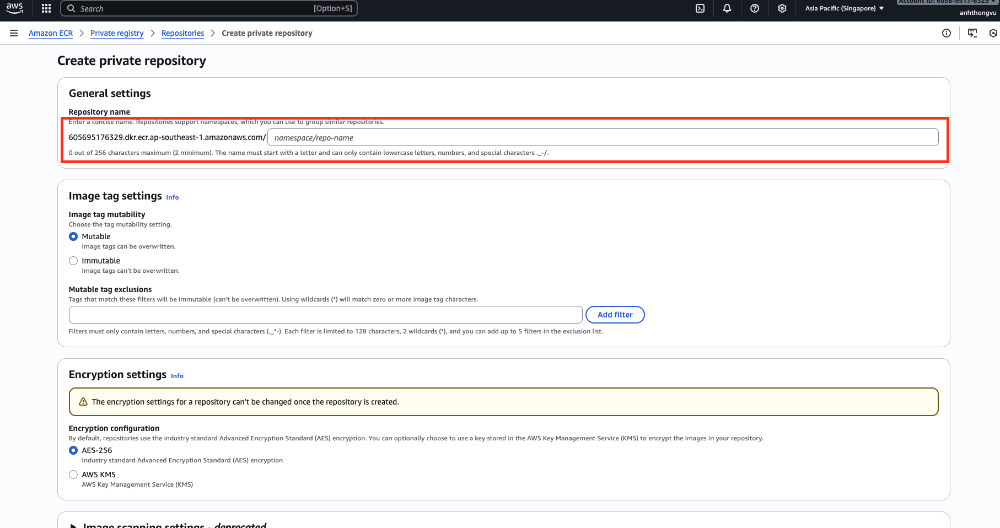
- Được kết quả như hình
  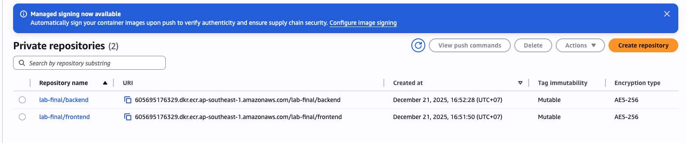
- Lập lại các bước trên nhưng ở phần điền tên repo ta để là lab-final/backend
- Phải tạo 2 cái như vậy vì ECR mỗi cái sẽ nhận 1 images của 1 loại, không gộp chung được như harbor
#### 2.2.2 Tạo credital cần thiết và chuẩn bị 1 repo git lab
- Cần chuẩn bị gitlab access token và ECR access token
- Lấy gitlab access token:
  - Vào setting -> Chọn developer setting ở cuối cùng như trong ảnh
  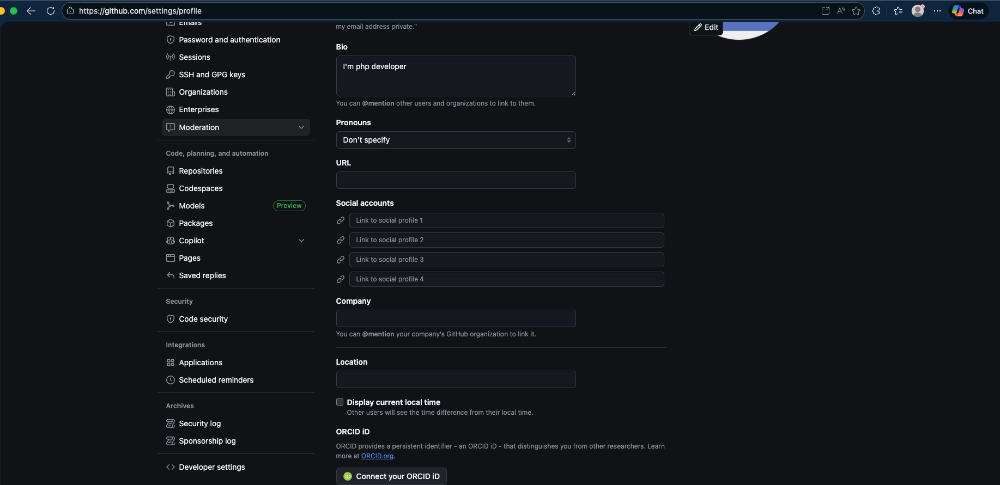
  - Vào Personal Access Token ->  Token(Classic) -> Generate new token -> Generate new token (classic)
    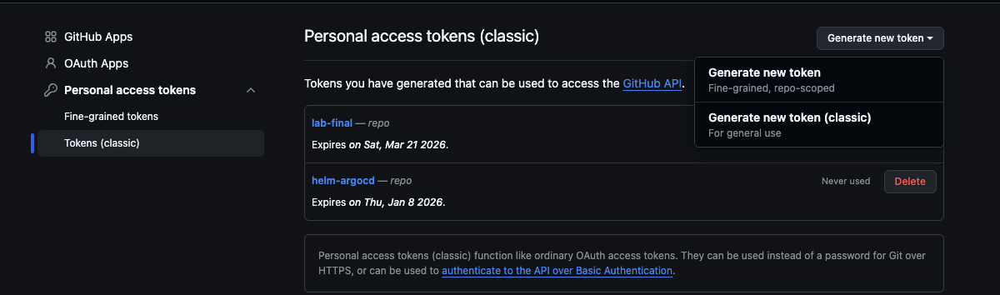
  - Điền tên vào mục Note và chọn tích repo như ảnh
    
  - Lưu token lại
    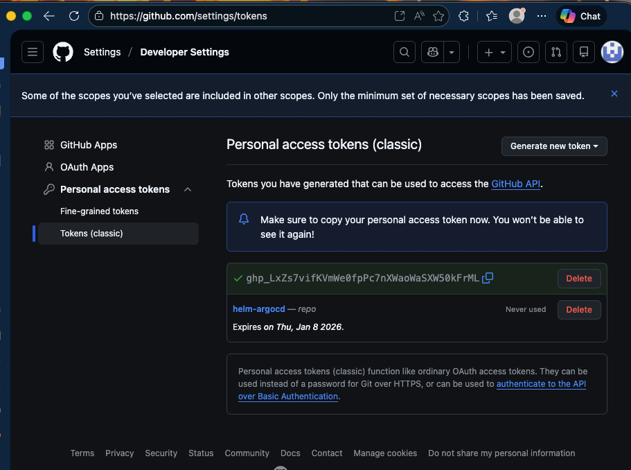
- Lấy ECR access token (chính là key khi tạo user) xem [tại đây](https://github.com/ThongVu1996/cd-ci-lab/blob/master/aws/install.md)
  - Trong trường hợp mà quên mất key đó rồi thì tạo key mới key như ảnh, các option thì vào link ngay trên để xem chi tiết
    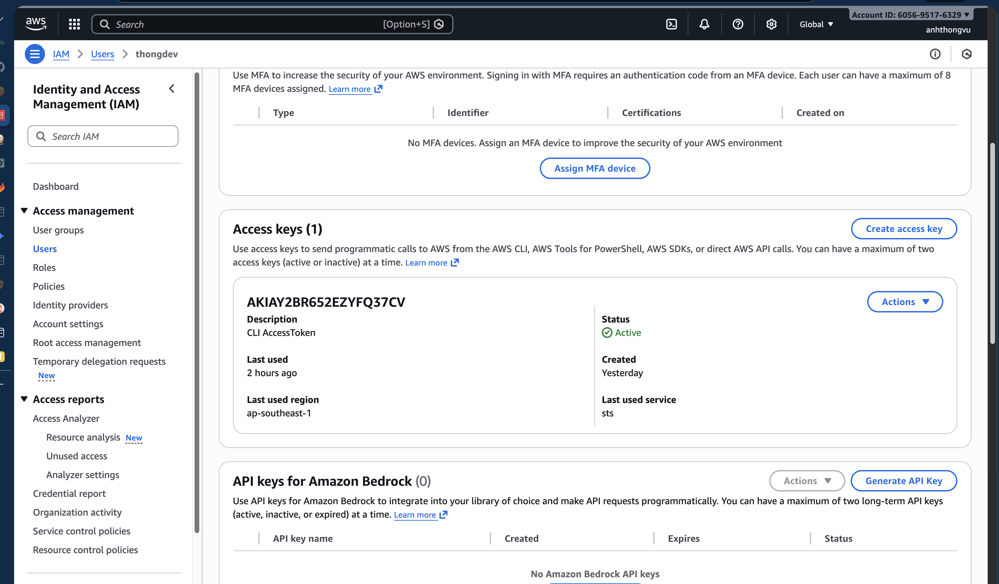
- Tạo `aws-ecr-creds` và `gitlab-repository-creds` vào ở trong Jenkins
  (các bước tạo xem [tại đây](https://github.com/ThongVu1996/cd-ci-lab/blob/master/all-in-one/all-in-one.md), search `Nhớ tạo credentials cho jenkins ở link Credential` cho nhanh thấy)
- Chuẩn bị 1 repo git lab giống [tại đây](https://github.com/ThongVu1996/lab-final)
  #### 2.2.2 Triển khai push images ECR, code lên gitlab
  

